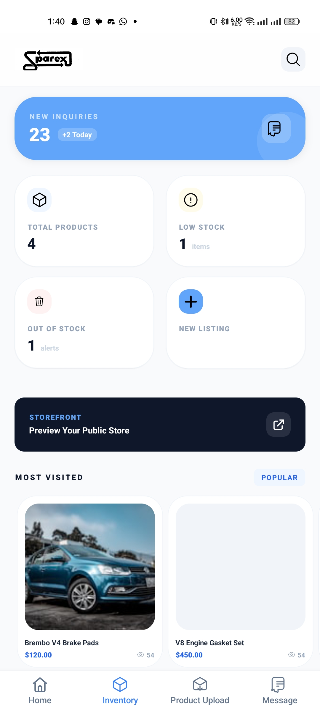
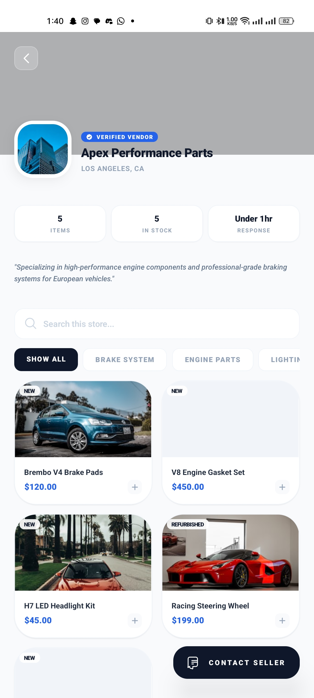
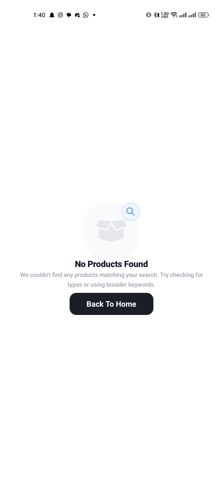
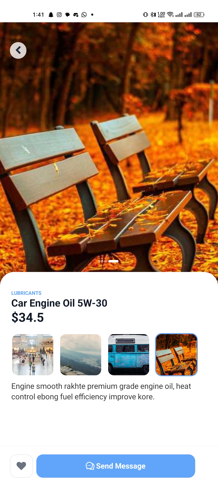
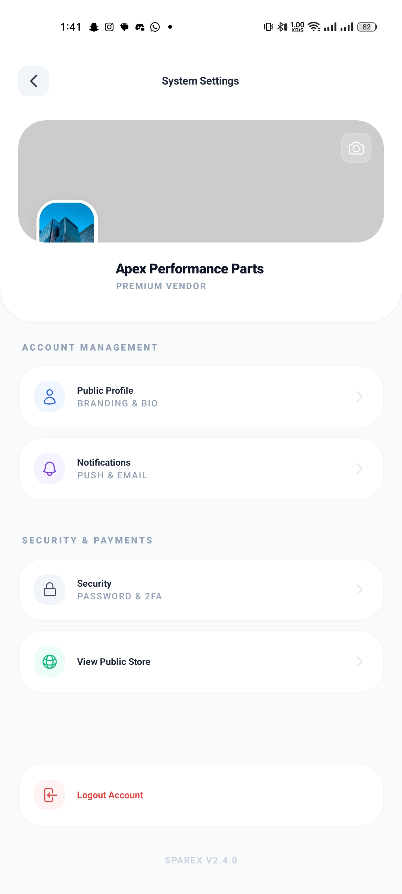
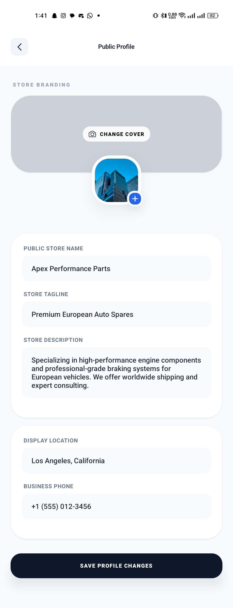

# SpareX Mobile

SpareX Mobile is an e-commerce car parts listing app focused on Middle East markets. It is built with Expo + React Native, uses Expo Router for file-based navigation, and NativeWind for Tailwind-style UI.

----

📌 **Primary Documentation**  


## Screenshots

<div style="display: flex; flex-wrap: wrap; gap: 12px;">
  
  
  
  
  
  
  
  
</div>

## Tech Stack

- Expo (React Native)
- Expo Router (file-based routing)
- NativeWind (Tailwind CSS for React Native)
- React Native SVG + Expo Image Picker

## Architecture Notes

- Routes and screens live under `app/` using Expo Router.
- Shared UI lives under `components/`, organized by feature.
- Styling is done with Tailwind classes via NativeWind.
- App icons and SVGs are centralized in `utils/icons.tsx`.
- Assets (images, icons) live under `assets/`.

## Environment Variables

No environment variables are required at this time.

## Prerequisites

- Node.js 18+ (LTS recommended)
- npm (comes with Node)
- Expo CLI (via `npx expo`)

Optional for device testing:
- iOS Simulator (Xcode, macOS)
- Android Emulator (Android Studio)
- Expo Go app on a physical device

## Installation

```bash
npm install
```

## Running the App

Start the dev server:

```bash
npm run start
```

Then choose a target:

- iOS simulator: press `i`
- Android emulator: press `a`
- Web: press `w`
- Physical device: scan the QR code with Expo Go

You can also run platform-specific commands:

```bash
npm run ios
npm run android
npm run web
```

## Project Structure (Quick View)

- `app/` — routes and screens (Expo Router)
- `components/` — reusable UI components
- `utils/` — helpers and icons
- `assets/` — images and static assets
- `global.css` — NativeWind/Tailwind setup

## Linting

```bash
npm run lint
```
# project-index
